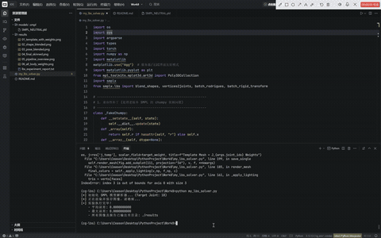
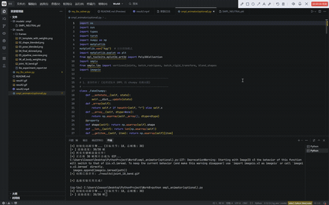

# LBS蒙皮与关节旋转

## 实验演示

### 1. 基础蒙皮形变验证
  

### 2. 关节旋转动画展示（选做实验）
  

## 实验目标

通过本次实验，你将能够：

- 深刻理解 **线性混合蒙皮 (Linear Blend Skinning, LBS)** 的数学原理及其在骨骼动画中的核心作用。
- 深入剖析 **SMPL 参数化人体模型** 的底层机制，包括体型混合形状 (Shape Blend Shapes) 与姿态混合形状 (Pose Blend Shapes)。
- 掌握如何将骨骼空间的局部旋转平移变换，通过蒙皮权重矩阵映射为表面顶点的全局坐标。
- 抛弃官方封装的黑盒函数，**纯手工从零推导计算**完整的 LBS 管线，并严格对齐官方 `smplx` 库的正向传播结果以验证精度。
- **[选做扩展]** 掌握骨骼局部旋转的连续插值方法，通过生成关键帧动画，直观观察蒙皮权重如何“像橡皮筋一样”平滑带动关节周围的皮肤折叠与拉伸。

## 实验背景与数学原理

### 1. SMPL 模型的形变管线
SMPL (Skinned Multi-Person Linear Model) 是一个数据驱动的参数化人体模型。一个静止的模板网格（Template Mesh）要变为具有特定体型和动作的最终网格，需要经历以下阶段：
- **形状混合 (Shape Blend Shapes)**：根据体貌参数 $\vec{\beta}$（Betas）修正模板顶点。
  $$V_{shape} = V_{template} + B_S(\vec{\beta})$$
- **姿态混合 (Pose Blend Shapes)**：为了修正由于关节大幅度弯曲导致的“糖果纸收缩（体积丢失）”现象，根据姿态参数 $\vec{\theta}$（Pose）追加姿态偏移量。
  $$V_{pose} = V_{shape} + B_P(\vec{\theta})$$

### 2. 线性混合蒙皮 (Linear Blend Skinning)
获取了包含形状与姿态修正的顶点 $V_{pose}$ 后，需要将其与人体骨架进行绑定。对于表面上的任意一个顶点 $v_i$，其最终的世界坐标 $v'_i$ 是由影响它的所有骨骼关节的变换矩阵加权求和决定的：
$$v'_i = \sum_{j=1}^{K} w_{i,j} T_j \begin{bmatrix} v_i \\ 1 \end{bmatrix}$$
其中，$w_{i,j}$ 是第 $j$ 个关节对第 $i$ 个顶点的**蒙皮权重 (Skinning Weight)**，且保证 $\sum w_{i,j} = 1$。$T_j$ 是第 $j$ 个关节沿着骨骼层级树累乘得到的 $4 \times 4$ 全局齐次变换矩阵。

## 核心实现要点与工程优化

### 1. 面向对象架构与逻辑解耦
有别于传统的面条式 (Spaghetti) 脚本，本实验对代码架构进行了深度重构。建立了独立的 `ManualSMPLSolver` 类负责纯粹的张量数学推导与误差验证，以及 `MeshVisualizer` 类专门负责 3D 场景渲染。这种解耦设计极大提升了代码的可读性与扩展性。

### 2. 跨版本兼容性处理 (Shape & Dependences)
官方释出的不同版本的 SMPL 模型（如老版本的 `.pkl` 格式）在加载时常面临 `chumpy` 库的依赖遗留问题，以及 `posedirs` 张量形状（Transpose）不一致导致的矩阵乘法崩溃。本实现在底层编写了 `_FakeChumpy` 补丁以及张量形状自适应修正函数，确保环境轻量化的同时兼容绝大多数官方模型。

### 3. Numpy 进阶切片陷阱规避
在进行多维数组的坐标系转换（如 `Y`、`Z` 轴互换）时，若同时使用整数索引、切片和数组索引，会触发 Numpy 的高级广播机制，导致输出维度异常前置。本实验通过将切片操作拆分为两步连乘，彻底修复了该隐蔽 Bug，保证了网格渲染的稳定性。

### 4. 渲染管线的视觉提升
为了获得出版级别的可视化结果，实验重写了 Matplotlib 的渲染逻辑：
- 引入了基于面片法向量与虚拟定向光点乘的**基础光照模型 (Directional Lighting)**，赋予纯色网格真实的立体阴影质感。
- 采用高对比度的 `plasma` 与定性色板 `tab20` 替代了默认的冷暖色调，使得蒙皮权重的热力图分布以及全身体积分割更加直观、清晰。

### 5. 姿态动画与动图合成 (选做扩展)
为了动态展示 LBS 的平滑特性，实验新增了连续动画生成模块：
- **控制变量法**：严格固定体型（Shape）参数不变，仅提取特定关节（如肘部/膝盖）对应的旋转参数进行修改。
- **平滑插值**：使用正弦函数对关节的旋转角度进行从 0 到目标角度的往复插值运算，模拟真实的缓动（Ease-in, Ease-out）物理运动。
- **相机锁定**：在逐帧渲染时，强行锁定 Matplotlib 的 3D 包围盒与相机视角，避免动画播放时出现坐标轴自适应缩放导致的画面剧烈抖动。
- **合成为 GIF**：利用 `imageio` 库将渲染出的连续关键帧自动合并为高帧率的动图，直观展示权重过渡区域的柔性形变特征。

## 运行方式与依赖

- 环境版本：`Python 3.10+`
- 核心依赖库：`torch`, `numpy`, `matplotlib`, `smplx`, `imageio` (建议无 GPU 环境直接安装 CPU 版 PyTorch)
- 目录结构要求：确保 `models/smpl/SMPL_NEUTRAL.pkl` 文件已放置到位。

### 执行主实验（静态推导与对齐验证）
在当前目录下，打开终端（需激活对应的 conda 环境）运行主脚本：
```bash
python my_lbs_solver.py --model_path ./models --output_path ./results --joint_idx 18